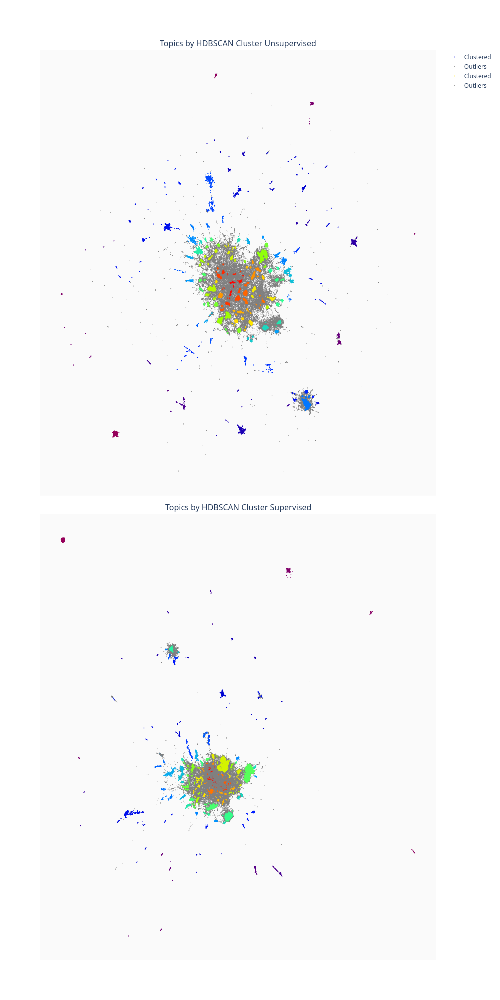

# readme.md

## Plot

See [this file](figures/animation/animation_week.html) to see an animation of how topics get activity over time, in weekly slices




## Enviroment Setup

```bash
conda create -n intro-ai python=3.8
conda activate intro-ai
conda install ipykernel
conda install -c conda-forge numpy pandas    

# Windows specific command
conda install pytorch cudatoolkit=11.6 -c pytorch -c conda-forge

# Mac specific command
conda install pytorch -c pytorch

# These three commands are for both mac and windows, feel free to try to oneline it for a bit of a conda chalange
conda install -c conda-forge -c plotly sentence-transformers umap-learn hdbscan plotly nbformat python-kaleido 


# windows oneliner
conda create -n intro-ai python=3.8 ipykernel numpy pandas pytorch cudatoolkit=11.6 sentence-transformers umap-learn hdbscan plotly nbformat python-kaleido -c pytorch -c conda-forge -c plotly

```